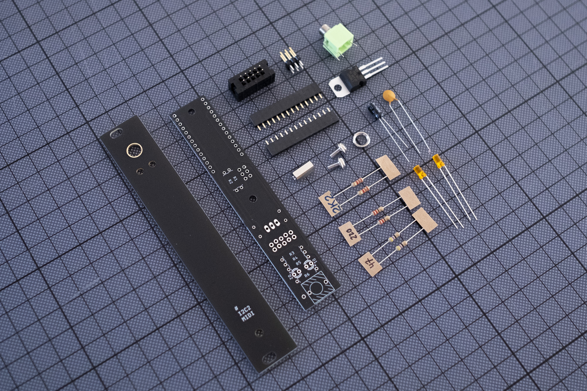
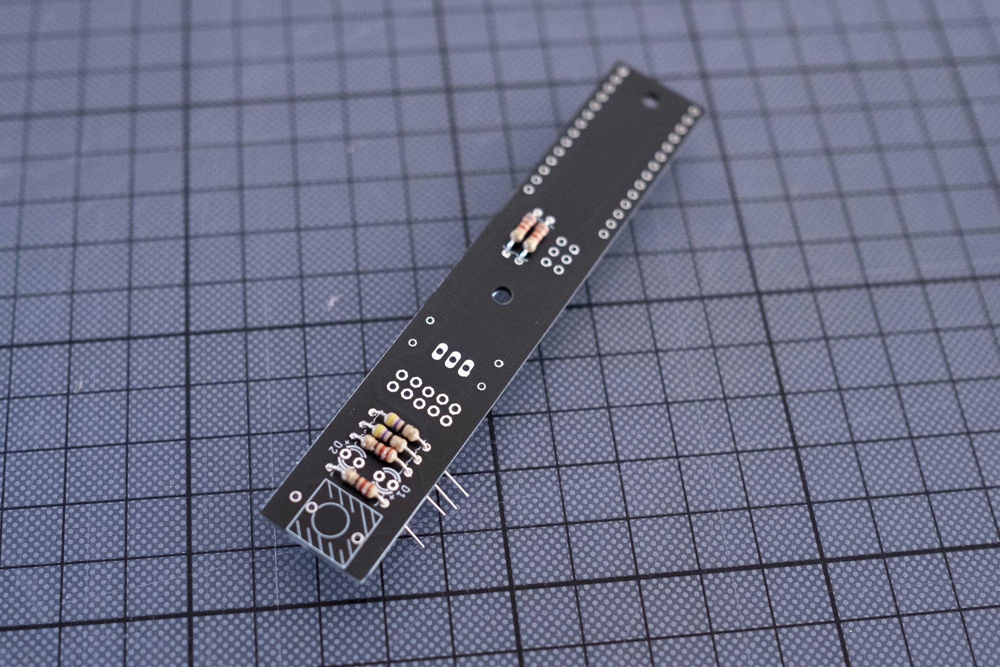

# Build Guide MKI

## I 
Get the parts. Here's the [BOM](https://github.com/attowatt/i2c2midi/tree/main/hardware/i2c2midi_hardware_MK1#BOM).

## II
- Solder the following parts:
  - Resistors (R1, R2, R3, R4, R5)
  - Voltage regulator: Bend the legs before soldering.
  - Power header: Please check the orientation – the opening of the header should be on the right, when -12V is on the bottom.
  - Capacitors: C1 (0.33 uF) negative side (white line, short leg) should be facing away from the power header. Orientation of C2 (0.1 uF) capacitor does not matter. 
  - I2C header
  - Teensy header: I prefer to solder a few pins with the Teensy board attached (to make sure it will fit later), then remove the Teensy and solder the rest of the pins.
- Cut the legs of the parts.

## III
- Mount the spacer to the PCB with one of the two M3 screws.
- Place the stereo jack (U1) and leds into their positions, but don't solder them yet.
- Place the panel on top of the stereo jack and spacer. Mount it to the jack with the nut and to the spacer with the second M3 screw.

## IV
- Carefully place the LEDs into position, so they look nice on the panel. Then solder them.
- Solder the stereo jack.

## V
Flash the firmware to the Teensy.
Don't connect the module to Euro power and USB at the same time! 

**Via Teensyduino**
- Download the firmware and open it with [Teensyduino](https://www.pjrc.com/teensy/td_download.html).
- Connect the Teensy to your computer with a USB cable.
- Under `Tools`, set `Board` to `Teensy 3.2`, `USB Type` to `Serial`, and select the `Port` that shows the Teensy.
- Upload the firmware to your Teensy via `Sketch` → `Upload`. 
- If the upload was successfull, i2c2midi lights up with both LEDs turning on and off four times.

**Via Teensy Loader** (not tested)
- Download and open the [Teensy Loader App](https://www.pjrc.com/teensy/loader.html).
- Connect the Teensy to your computer with a USB cable.
- Select `File` → `Open HEX File` and load the [HEX file of the firmware](../firmware/i2c2midi_firmware_v2_3/i2c2midi_firmware_v2_3.ino.hex).
- Select `Program`.
- If the upload was successfull, i2c2midi lights up with both LEDs turning on and off four times.

## Disclaimer:
After building the module, please test it very carefully in a separate case. This is a DIY module. I am not responsible for any damage to your gear.

