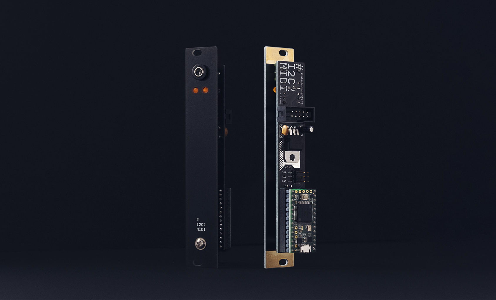

# i2c2midi

i2c2midi is a simple DIY 3 hp eurorack module that speaks I2C and MIDI. It's primarily build to be used together with [monome Teletype](https://monome.org/docs/teletype/). It receives I2C messages from Teletype and converts them to either MIDI notes or MIDI CC messages to control external devices like synths and effects.


## Table of content
[Details](#Details)  
[Usage](#usage)  
[About the firmware](#about-the-firmware)  
[Schematic](#schematic)  
[BOM](#BOM)  
[Changelog](#Changelog)  
[Thanks](#thanks)  



## Details
- DIY eurorack module (early stage)
- 4 hp
- Inputs: I2C 3 pin
- Outputs: MIDI TRS (Type A)
- Based on Teensy 3.2
 

## Usage
After connecting the module to Teletype via I2C, use the following code in a Teletype script:

**Send MIDI notes**
```
EX 2
EX.M.CH channel
EX.M.N note velocity
```

**Send MIDI CCs**
```
EX 2
EX.M.CH channel
EX.M.N controller value
```


**Note off messages**

The firmware takes care of Note off messages automatically, but is currently monophonic per channel. Note off messages are sent when a new Note on message arrives or after 500 ms. 

*Todo: Make the note duration of 500 ms editable via I2C as well.*
*Todo: Make it handle polyphony.*

**LEDs**

The left LED lights up when I2C messages are incoming.
The right LED lights up when MIDI messages are outgoing.


## About the firmware

As of now, the firmware is written specifically for I2C messages sent from [monome Teletype](https://monome.org/docs/teletype/) using the [disting Ex MIDI OPs](https://github.com/scanner-darkly/teletype/wiki/DISTING-EX-INTEGRATION) by [scanner-darkly](https://github.com/scanner-darkly). The i2c2midi module “poses” as a second disting.
Based on that setup, there are a few things to note and hardcoded within the firmware:

- The following addresses are specifically reserved for the disting EX within the Teletype firmware: `0x41`, `0x42`, `0x43`, `0x44` (65, 66, 67, 68). Since the module should act like a second disting EX, it is set up to listen to I2C messages on address `0x42` (66). This could be changed to act as the first (65), third (67) or fourth (68) disting EX instead.

- The I2C messages for the disting Ex are constructed as `<address> <command> <optional bytes according to command>`. See [here](https://github.com/scanner-darkly/teletype/wiki/DISTING-EX-I2C-SPECIFICATION) or [here](https://www.expert-sleepers.co.uk/distingEXfirmwareupdates.html) for further details. 

- The “send MIDI message” command of the disting Ex is `0x4F`(79) and is constructed as `<address> 0x4F <status> <optional data byte 0> <optional data byte 1>`.

- `<status>`refers to the [MIDI status](https://www.midimountain.com/midi/midi_status.htm). MIDI note on messages have the status 144-159 for channels 1-16. MIDI CC messages have the status 176-191 for channels 1-16.

- Sending a MIDI note on (e.g. note 48, velocity 127, channel 1) therefore looks like this: `0x42 0x4F 144 48 127`.

- Sending a MIDI CC (e.g. controller 1, value 60, channel 1) therefore looks like this: `0x42 0x4F 176 1 60`.

The firmware uses the [i2c_t3 Library](https://github.com/nox771/i2c_t3) for reading I2C and [Arduino MIDI library](https://github.com/FortySevenEffects/arduino_midi_library/) for sending MIDI.


## Schematic


**MIDI TRS Type A Wiring:**
Teensy | TRS | MIDI
--- | --- | ---
Teensy Pin 1 | → Tip | → MIDI Pin 5
Teensy 3V3 | → Ring | → MIDI Pin 4
Ground | → Sleeve | → MIDI Pin 2


## BOM

Part | Value
--- | ---
T32 | Teensy 3.2
C1 | 0.33 uF capacitor
C2 | 0.1 uF capacitor
D1 | LED 3 mm
D2 | LED 3 mm
I2C | PIN HEADER
IC1 | 7805 5V regulator
R1 | 2.2k Ω resistor
R2 | 2.2k Ω resistor
R3 | 47 Ω resistor
R4 | 47 Ω resistor
R5 | 220 Ω resistor
R6 | 220 Ω resistor
POW | Power Header (2x5)
U1 | Green Thonkiconn Stereo 3.5mm Audio Jack (PJ366ST)


## Changelog

**Version 2.0**
- Proper PCB
- Proper panel
- Added two LEDs

**Version 1.1**
- Added a voltage regulator, so the module can be powered from the case with a normal eurorack power ribbon cable.

**Version 1.0**
- Initial version using a protoboard and LEGO 2x16 plate as front panel.


## Thanks

- To [scanner-darkly](https://github.com/scanner-darkly) – for developing the disting EX Teletype OPs and helping out on several occasions during the making of this module.
- To [Ansome](https://www.instagram.com/ansomeuk/) – for helping me out on multiple occasions trying to learn Eagle CAD.
- To [TomWhitwell](https://github.com/TomWhitwell/RadioMusic) – for open-sourcing his modules and providing essential Eurorack Eagle parts.


## Sources

- https://www.pjrc.com/teensy/external_power.html
- https://www.pjrc.com/teensy/td_libs_MIDI.html
- https://github.com/nox771/i2c_t3
