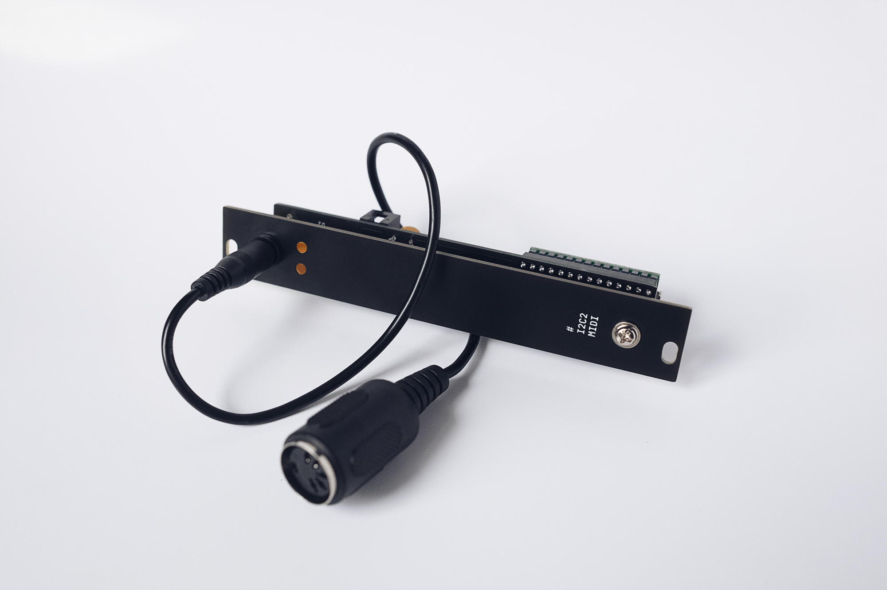
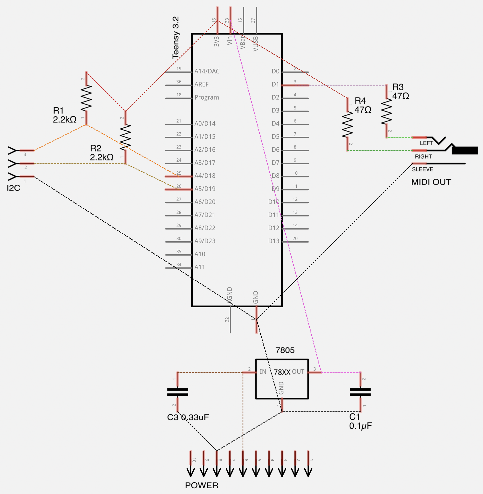
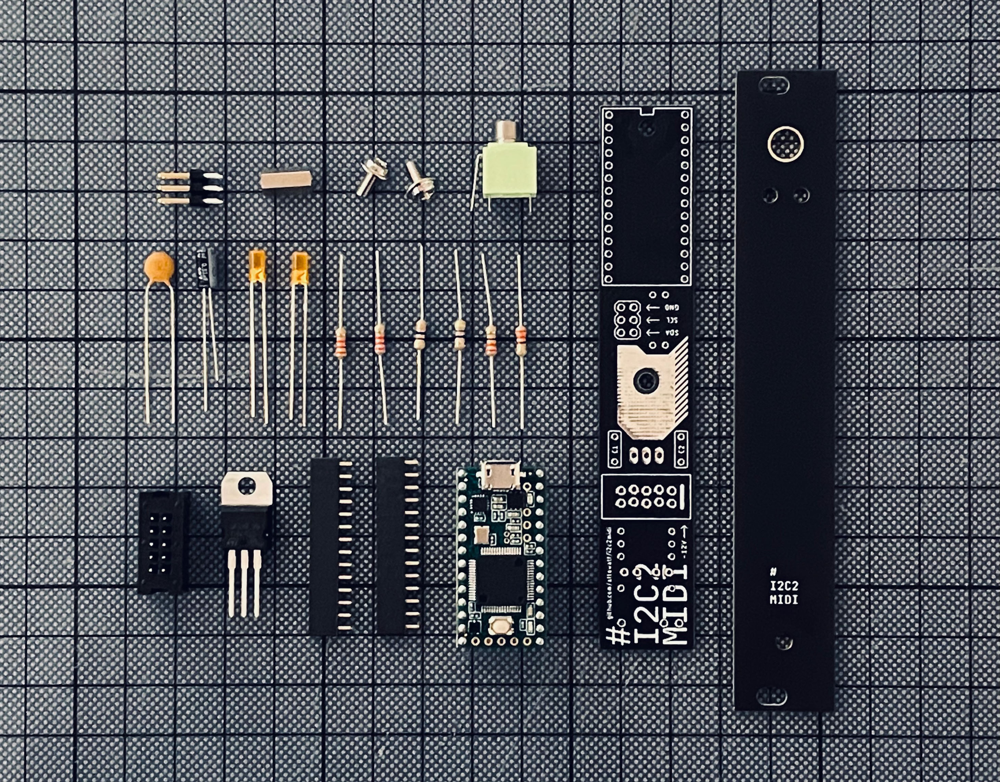

# i2c2midi

**i2c2midi is a DIY open source 2 hp eurorack module that speaks I2C and MIDI.**

i2c2midi is used together with [monome Teletype](https://monome.org/docs/teletype/) and external MIDI-enabled devices. 
It receives I2C messages from Teletype and converts them to MIDI notes, MIDI CC messages and other MIDI messages to control external devices like synths and effects. 
It receives MIDI CC and note message from external MIDI controllers and stores the values internally. These values can then be requested at any time by Teletype via I2C.

- MIDI out via TRS (Type A) and USB
- MIDI in via USB Host
- handles MIDI note off messages automatically
- settable note duration per note
- 8 voice polyphony per MIDI channel
- 16 MIDI channels simultaneously
- 2 HP, 42 mm depth

i2c2midi lines community thread: 
https://llllllll.co/t/i2c2midi-a-diy-module-that-translates-i2c-to-midi/


## Table of content
[Usage](#usage)  
[About the firmware](#about-the-firmware)  
[Schematic](#schematic)  
[BOM](#BOM)  
[Build Guide](#Build-Guide)  
[Changelog](#Changelog)  
[Thanks](#thanks)  





## Usage

**Send MIDI messages**

```
EX 2                      // tells Teletype that following code in the script is meant for i2c2midi
EX2:                      // tells Teletype that following line is meant for i2c2midi 
EX.M.CH channel           // set the MIDI channel
```
```
EX.M.N note velocity      // send MIDI Note
EX.M.CC controller value  // send MIDI CC
EX.M.PB value             // sent MIDI Pitch Bend (-8192 - 8191); affects all notes per channel
EX.M.PRG number           // sent MIDI Program Change
```
```
EX.M.CLK                  // send MIDI clock pulse
EX.M.START                // start MIDI transport start
EX.M.STOP                 // stop MIDI transport stop
EX.M.CONT                 // continue MIDI transport
```
```
EX.P 1 value              // set note duration in milliseconds
EX.P 2 value              // send MIDI Aftertouch value (0 - 127); affects all notes of last used channel
EX.P 99 value             // set I2C address of i2c2midi (65 for EX 1, 66 for EX 2, 67 for EX 3, 68 for EX 4)
```

**Note off messages**

The firmware takes care of Note off messages automatically, depending on the current note duration value (EX.P 1).

**Receive MIDI messages**
```
IAA 66             		  // set the I2C address (65, 66, 67, 68, depending on i2c2midi setting)
X IIB1 channel controller // request currently stored value for controller and assign to X 
```


**LEDs**

The left LED lights up when I2C messages are incoming.
The right LED lights up when MIDI messages are outgoing.


## About the firmware

**disting EX OPs**
The firmware is written specifically for I2C messages sent from [monome Teletype](https://monome.org/docs/teletype/) using the [disting Ex MIDI OPs](https://github.com/scanner-darkly/teletype/wiki/DISTING-EX-INTEGRATION) by [scanner-darkly](https://github.com/scanner-darkly). The i2c2midi module “poses” as a second disting.
Based on that setup, there are a few things to note and hardcoded within the firmware:

- The following addresses are specifically reserved for the disting EX within the Teletype firmware: `0x41`, `0x42`, `0x43`, `0x44` (65, 66, 67, 68). Since the module should act like a second disting EX, it is set up to listen to I2C messages on address `0x42` (66). This could be changed to act as the first (65), third (67) or fourth (68) disting EX instead.

- The I2C messages for the disting Ex are constructed as `<address> <command> <optional bytes according to command>`. See [here](https://github.com/scanner-darkly/teletype/wiki/DISTING-EX-I2C-SPECIFICATION) or [here](https://www.expert-sleepers.co.uk/distingEXfirmwareupdates.html) for further details. 

- The “send MIDI message” command of the disting Ex is `0x4F`(79) and is constructed as `<address> 0x4F <status> <optional data byte 0> <optional data byte 1>`.

- `<status>`refers to the [MIDI status](https://www.midimountain.com/midi/midi_status.htm). MIDI note on messages have the status 144-159 for channels 1-16. MIDI CC messages have the status 176-191 for channels 1-16.

- Sending a MIDI note on (e.g. note 48, velocity 127, channel 1) therefore looks like this: `0x42 0x4F 144 48 127`.

- Sending a MIDI CC (e.g. controller 1, value 60, channel 1) therefore looks like this: `0x42 0x4F 176 1 60`.

- Same applies to MIDI Pitch Bend and Program Change messages.

- There is also a general I2C message used to control parameters of a disting Ex algorithm. This message is hijacked for additional parameters of the i2c2midi module. E.g. parameter 1 is hardcoded for note duration, parameter 2 for Aftertouch, etc.

**Generic I2C OPs**
For "MIDI in" functionality, the firmware uses the [generic I2C OPs](https://github.com/monome/teletype/blob/main/docs/ops/i2c.toml) of Teletype.

**Connecting the Teensy to your computer**
Caution: Do not connect power from the modular and the default USB port of the Teensy at the same time, unless you have separated the 5V pads on the Teensy!! Otherwise you will damage your Teensy. For more info, please follow [this link](https://www.pjrc.com/teensy/external_power.html).
   
**Libraries used**
- [i2c_t3](https://github.com/nox771/i2c_t3) for reading I2C
- [Arduino MIDI library](https://github.com/FortySevenEffects/arduino_midi_library/) for sending MIDI
- [USBHost_t36](https://github.com/PaulStoffregen/USBHost_t36) for USB host


## Schematic



**MIDI TRS Type A Wiring:**

Teensy | TRS | MIDI
--- | --- | ---
Teensy Pin 1 | → Tip | → MIDI Pin 5
Teensy 3V3 | → Ring | → MIDI Pin 4
Ground | → Sleeve | → MIDI Pin 2


## BOM

Number | Part | Value
--- | --- | ---
1 | T36 | Teensy 3.6 (with pins or without pins)
2 | C1 | 10 uF capacitor
3 | C2 | 10 uF capacitor
4 | D1 | LED 3 mm
5 | D2 | LED 3 mm
6 | IC1 | LM1117 5V regulator
7 | R1 | 47 Ω resistor
8 | R2 | 47 Ω resistor
9 | R3 | 2.2k Ω resistor
10 | R4 | 2.2k Ω resistor
11 | R5 | 220 Ω resistor
12 | R6 | 220 Ω resistor
13 | TRS | Green Thonkiconn Stereo 3.5mm Audio Jack (PJ366ST)
14 | USB | USB Jack Type A vertical
15 | POW | 2x5 male pin header angled
16 | I2C | 2x3 male pin header angled
17 | BRD | 1x10 male pin header angled
18 |  | 10 mm M3 Hex standoff
19 |  | 10 mm M3 screw
20 |  | 10 mm M3 screw
21 | | Nut for Thonkiconn
22 | | 1x5 male pin header (for USB host)
23 | | 1x24 male pin header (if Teensy has no pins)
24 | | 1x24 male pin header (if Teensy has no pins)

Here are the [Gerber files](https://github.com/attowatt/i2c2midi/tree/main/hardware/gerber) for the PCB and panel.

Here are some [more details](https://llllllll.co/t/i2c2midi-a-diy-module-that-translates-i2c-to-midi/40950/56) about ordering the PCB and Pancel from a manufacturer.




## Build Guide

Coming soon …

## Changelog

**Version 3.0 (MKII)**
- Firmware for i2c2midi hardware MKII, adding USB Host functionality.


## Thanks
Many thanks to everyone who contributed and helped making this module a reality (in no particular order): [scanner-darkly](https://github.com/scanner-darkly), [Ansome](https://www.instagram.com/ansomeuk/), [Tom Whitwell](https://twitter.com/tomwhitwell), [Konstantine](https://www.instagram.com/konstantine.f/), [mxmxmx](https://github.com/mxmxmx), [littlescale](https://www.instagram.com/littlescale/), [non.verbal.poetry](https://www.instagram.com/non.verbal.poetry/)


## Sources

- https://www.pjrc.com/teensy/external_power.html
- https://www.pjrc.com/teensy/td_libs_MIDI.html
- https://github.com/PaulStoffregen/USBHost_t36
- https://github.com/nox771/i2c_t3
- https://github.com/TomWhitwell/MTM-Parts-Library
- https://github.com/monome/teletype/blob/main/docs/ops/i2c.toml
