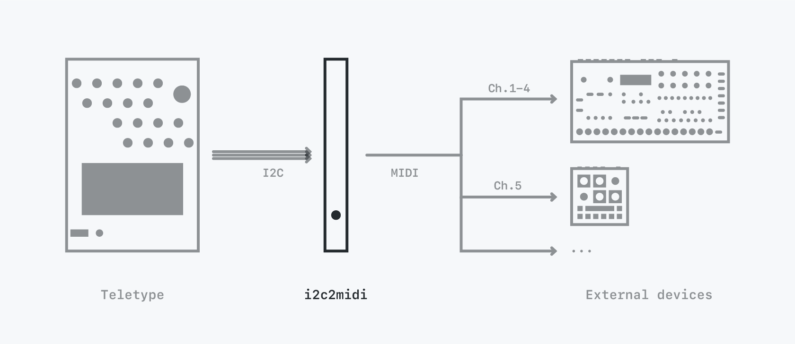
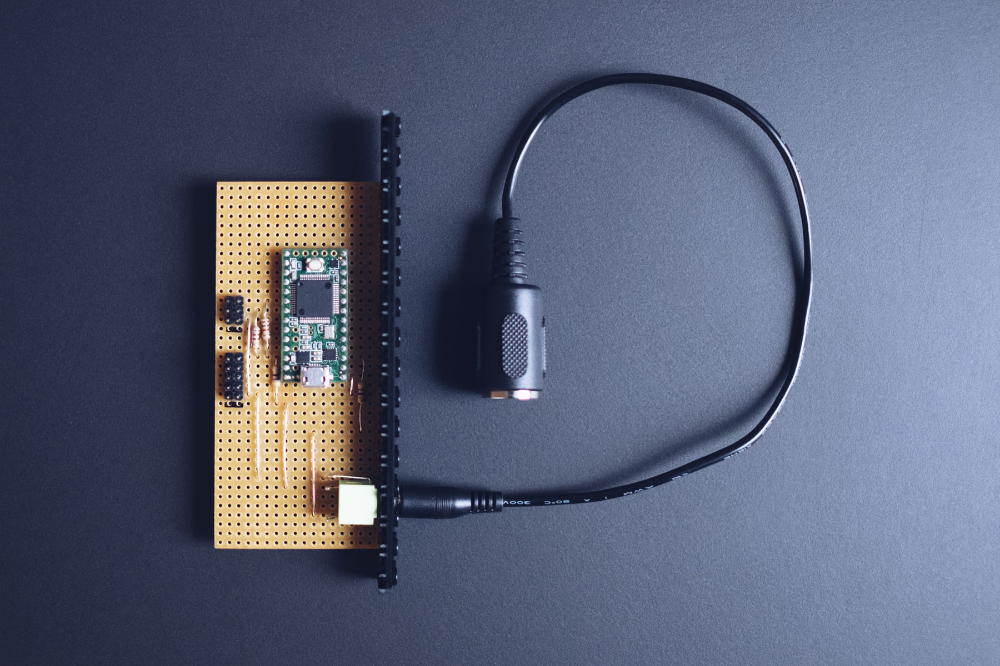
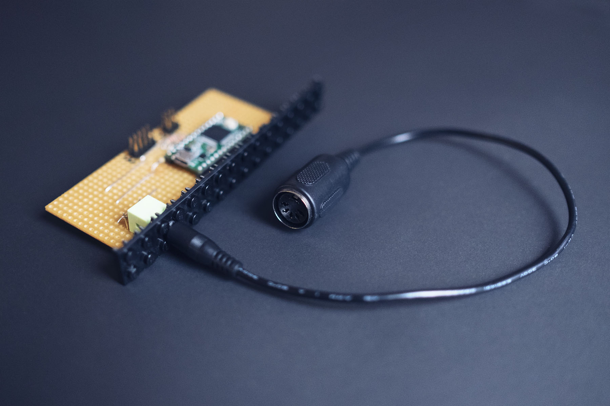
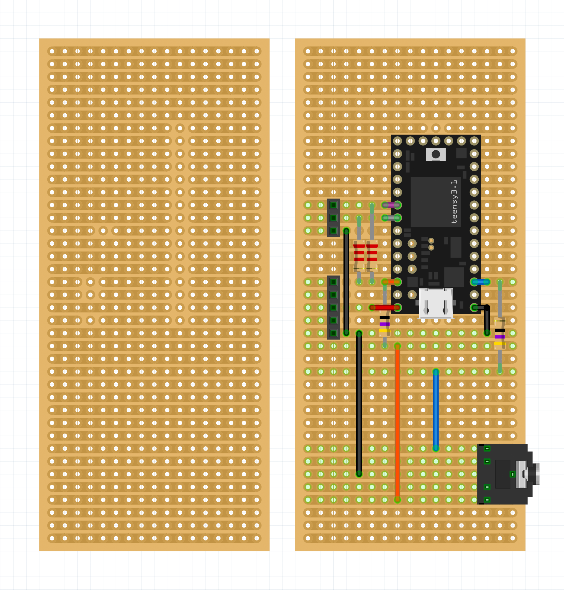
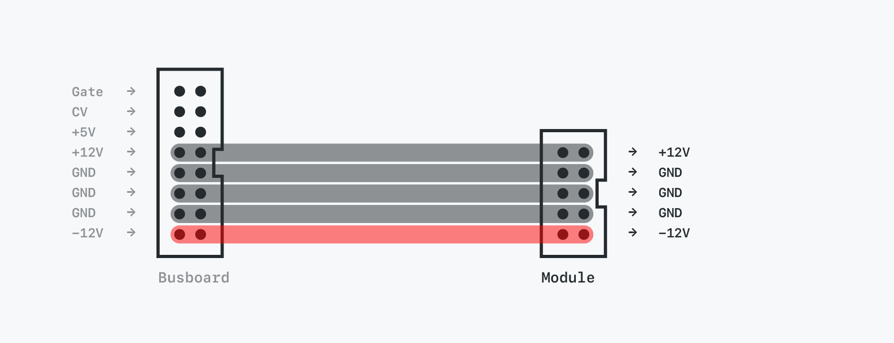
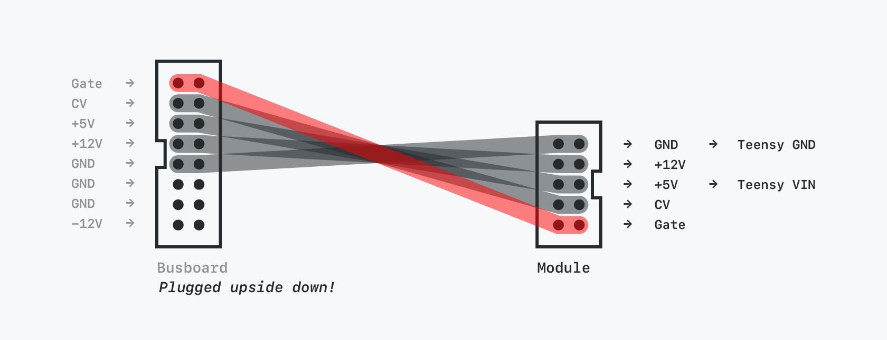

# i2c2midi

i2c2midi is a simple DIY 3 hp eurorack module that speaks I2C and MIDI. It's primarily build to be used together with [monome Teletype](https://monome.org/docs/teletype/). It receives I2C messages from Teletype and converts them to either MIDI notes or MIDI CC messages to control external devices like synths and effects.

*Currently in prototype status: The first prototype was built using a horizontal protoboard and a LEGO 2x16 plate as front panel.*  
*Collaboration is welcomed: Ideas, recommendations, tips and help for improvement are greatly appreciated.*



## Table of content
[Specs](#specs)  
[Usage](#usage)  
[About the firmware](#about-the-firmware)  
[Schematic](#schematic)  
[Protoboard layout](#protoboard-layout)  
[Powering it from a Eurorack bus board](#powering-it-from-a-eurorack-bus-board)  
[Repository content](#repository-content)   
[Thanks](#thanks)  


## Details
- DIY eurorack module (prototype)
- 3 hp (LEGO front panel)
- Inputs: I2C 3 pin
- Outputs: MIDI TRS (Type A)
- Based on Teensy 3.2
 
*Todo: Create a PCB and proper front panel.*






## Usage
After connecting the module to Teletype via I2C, use the following code in a Teletype script:

**Send MIDI notes**
```
EX 2
EX.M.CH channel
EX.M.N note velocity
```

**Send MIDI CCs**
```
EX 2
EX.M.CH channel
EX.M.N controller value
```


**Note off messages**

The firmware takes care of Note off messages automatically, but is currently monophonic per channel. Note off messages are sent when a new Note on message arrives or after 500 ms. 

*Todo: Make the note duration of 500 ms editable via I2C as well.*
*Todo: Make it handle polyphony.*

## About the firmware

As of now, the firmware is written specifically for I2C messages sent from [monome Teletype](https://monome.org/docs/teletype/) using the [disting Ex MIDI OPs](https://github.com/scanner-darkly/teletype/wiki/DISTING-EX-INTEGRATION) by [scanner-darkly](https://github.com/scanner-darkly). The i2c2midi module “poses” as a second disting.
Based on that setup, there are a few things to note and hardcoded within the firmware:

- The following addresses are specifically reserved for the disting EX within the Teletype firmware: `0x41`, `0x42`, `0x43`, `0x44` (65, 66, 67, 68). Since the module should act like a second disting EX, it is set up to listen to I2C messages on address `0x42` (66). This could be changed to act as the first (65), third (67) or fourth (68) disting EX instead.

- The I2C messages for the disting Ex are constructed as `<address> <command> <optional bytes according to command>`. See [here](https://github.com/scanner-darkly/teletype/wiki/DISTING-EX-I2C-SPECIFICATION) or [here](https://www.expert-sleepers.co.uk/distingEXfirmwareupdates.html) for further details. 

- The “send MIDI message” command of the disting Ex is `0x4F`(79) and is constructed as `<address> 0x4F <status> <optional data byte 0> <optional data byte 1>`.

- `<status>`refers to the [MIDI status](https://www.midimountain.com/midi/midi_status.htm). MIDI note on messages have the status 144-159 for channels 1-16. MIDI CC messages have the status 176-191 for channels 1-16.

- Sending a MIDI note on (e.g. note 48, velocity 127, channel 1) therefore looks like this: `0x42 0x4F 144 48 127`.

- Sending a MIDI CC (e.g. controller 1, value 60, channel 1) therefore looks like this: `0x42 0x4F 176 1 60`.

The firmware uses the [i2c_t3 Library](https://github.com/nox771/i2c_t3) for reading I2C and [Arduino MIDI library](https://github.com/FortySevenEffects/arduino_midi_library/) for sending MIDI.

## Schematic


## Protoboard layout

**BOM:**
- Teensy 3.2
- 2 x 2.2kΩ Resistor (R1, R2)
- 2 x 47Ω Resistor (R3, R4)
- 2 x 5 generic female header pins (or proper 10 pin shrouded header)
- 2 x 3 generic female header pins
- 1 x Green Thonkiconn Stereo 3.5mm Audio Jack (PJ366ST) (Note: graphic shows different jack)

The following graphic shows the Protoboard with (right) and without components (left). Note the deliberately broken connections on the board:




## Powering it from a Eurorack bus board

As of now, I went with a dirty hack to power the module directly from a Eurorack case. Please be warned – *this is NOT a good solution and one should proceed with absolute caution and at their own risk!*

In order to access +5V from the bus board and to power the Teensy via its VIN pin (5V-6V tolerant), I use a standard eurorack 16 to 10 pin power cable – with the 16 pin jack plugged to the bus board ***UPSIDE DOWN***. Again, please be careful when messing with Eurorack power.

*Todo: Use a 7805 5V regulator to use standard +12V from the bus board.*

**Standard Eurorack**



***REVERSED (!!!)* to access +5V**



## Repository content
- `firmware` — The Teensy/Arduino code that converts I2C messages to MIDI out messages.
- `hardware` — Everything hardware related
  - Schematic
  - Protoboard layout (with and without components)
  - Fritzing file
  - Illustration regarding the power cabling (!)
- `pictures` — Some pictures of the first working prototype.


## Thanks

Thanks to [scanner-darkly](https://github.com/scanner-darkly) for developing the disting EX Teletype OPs and helping out on several occasions during the making of this module.


## Sources
- https://www.pjrc.com/teensy/external_power.html
- https://www.pjrc.com/teensy/td_libs_MIDI.html
- https://github.com/nox771/i2c_t3
