# Build Guide MKII

## I 
Get the parts. Here's the [BOM](https://github.com/attowatt/i2c2midi#BOM).

Let's start with PCB a.

## II
- Solder the following parts to PCB a, in this order:
  - Voltage regulator (IC1)
  - Resistors: 47 Ω (R1, R2), 2.2k Ω (R3, R4), 220 Ω (R5, R6)
  - 2x5 angled pin header (Power connection) & 2x3 angled pin header (I2C connection)
  - Capacitors (C1, C2)
- Cut the legs of the parts as short as possible.

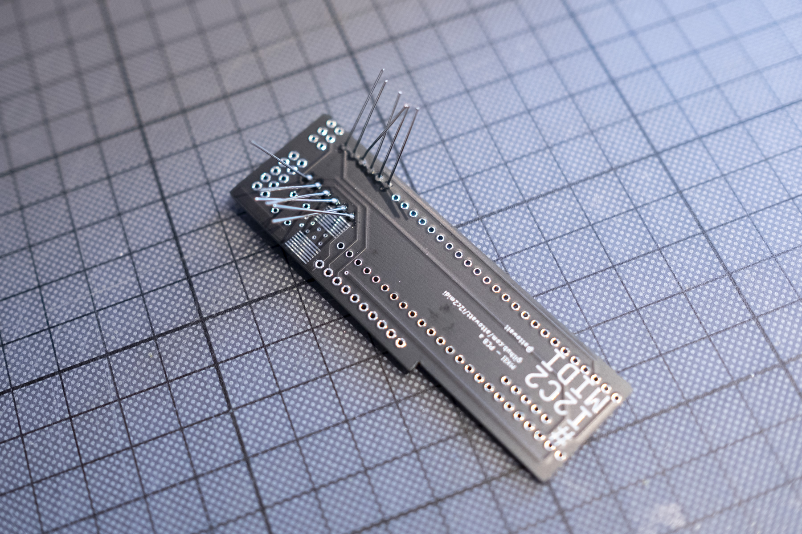
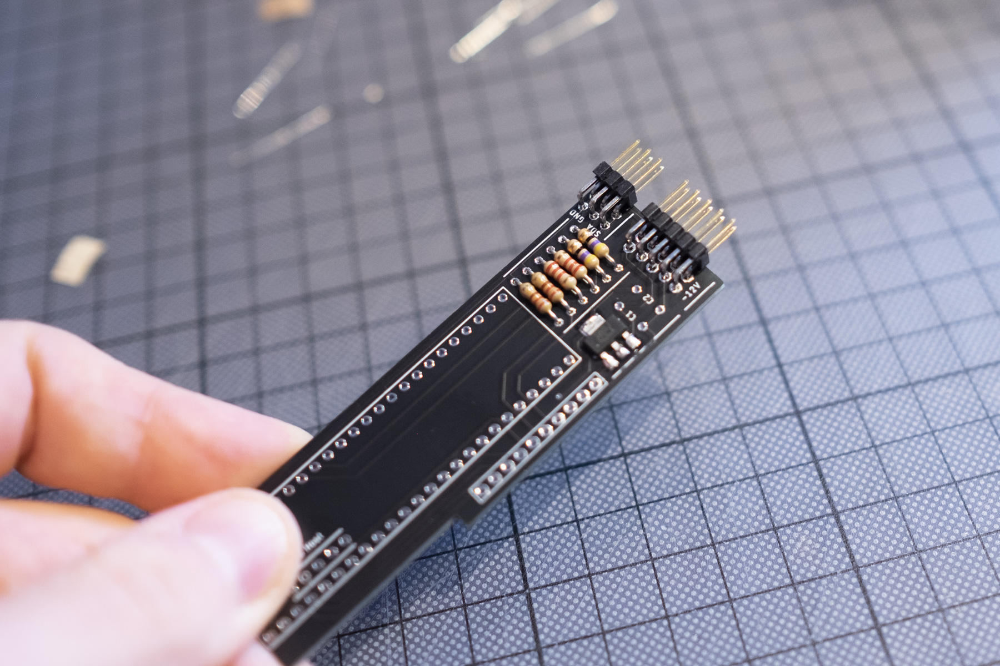
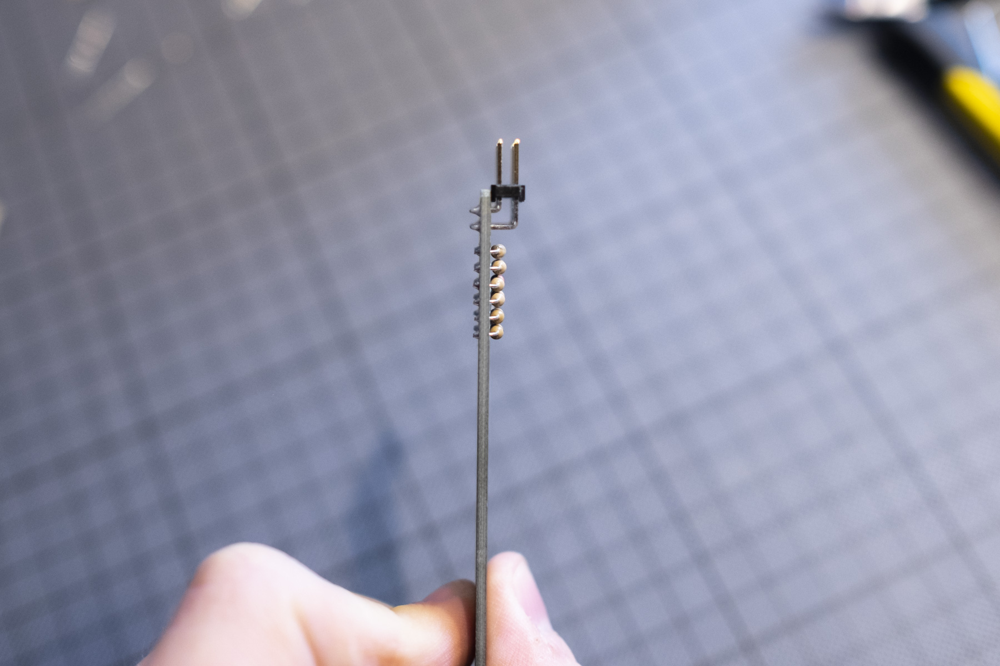

## III
*A quick note before we continue with the Teensy: If you plan to use the Micro USB jack of the Teensy for sending MIDI device data to a host (e.g. a compouter) alongside the USB host connection on the i2c2midi front panel: Please cut the "5V pad" on the Teensy before soldering! More information please see: https://www.pjrc.com/teensy/external_power.html   
Be aware, that if you cut the pads, powering i2c2midi will then only be possible via eurorack, so flashing the firmware has to be done while connected to your eurorack case.*

- If your Teensy 3.6 comes with pins: Place the 1x5 pin header for USB Host on the PCB, with the shorter legs facing up. Then place the Teensy on top.
- If your Teensy 3.6 comes without pins: Place the two 1x24 pin headers on the PCB, with the shorter legs facing up. Same with the 1x5 pin header for USB Host. Then place the Teensy on top. You can also use shorter pin headers if you don't have 1x24s, since not all Teensy Pins are needed (as seen in the picture). Please refer to the following graphic for which pins need to be soldered.
- I prefer to secure the Teensy with a rubber band to the PCB, then solder the four pins in each corner of the Teensy first.
- Afterwards, I solder the remaining pins, on PCB and Teensy respectively. 

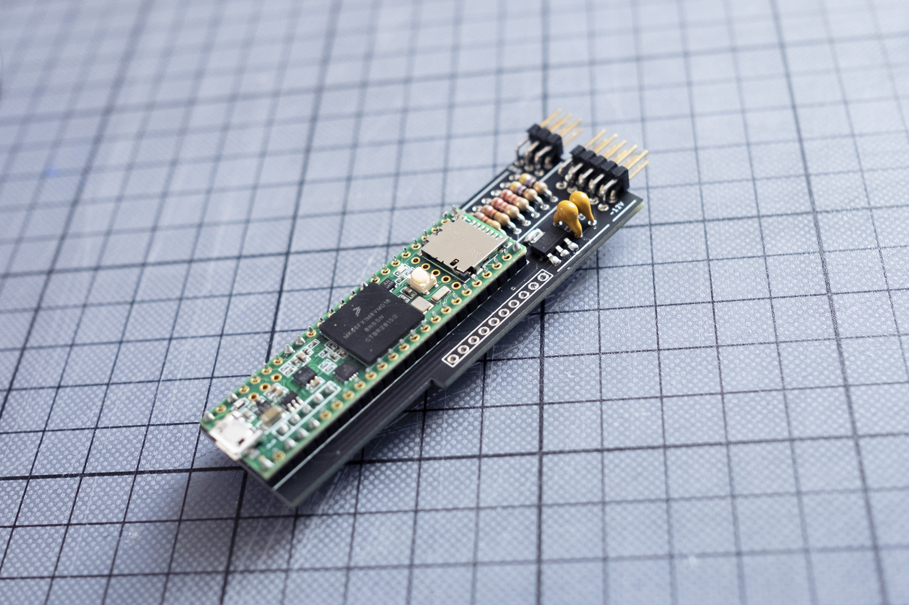
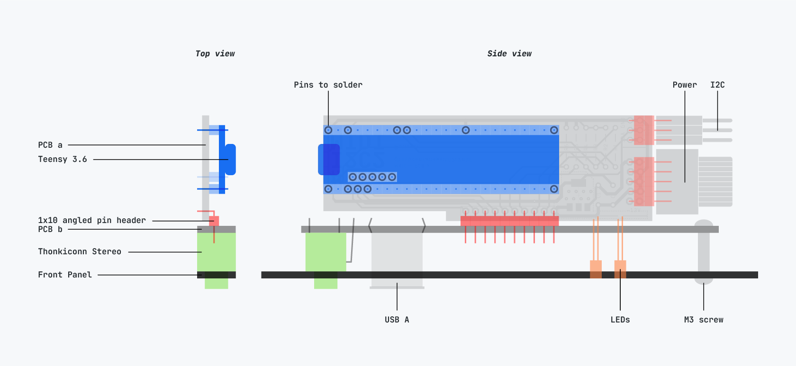

PCB a done. Let's continue with PCB b.

## IV

- Solder the 1x10 angled pin header to PCB b. Note the orientation: If the LEDs are on the bottom, the pins point to the right.
- Make sure it sits straight on the PCB. I prefer to secure the header in place with an excess spacer (1x1 or 1x2 with metal pins removed), and solder the two outer pins. I then remove the extra spacer and solder the remaining pins.

## V

- Mount the spacer to PCB b with one of the two M3 screws.
- Place the Thonkiconn stereo jack and LEDs into their positions, but don't solder them yet. Mind the orientation of the LEDs: The longer leg is `+`.
- Grab the Panel and place the USB jack through the panel.
- Place the panel on top of the stereo jack and spacer, and place the USB jack into the PCB. Secure the panel to the jack with the nut and to the spacer with the second M3 screw.

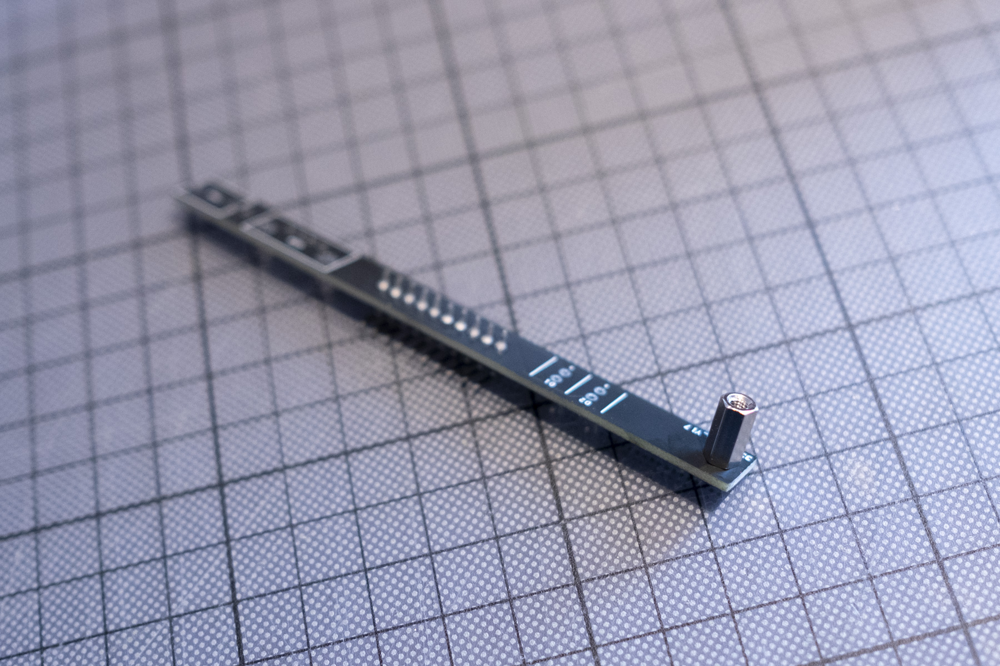
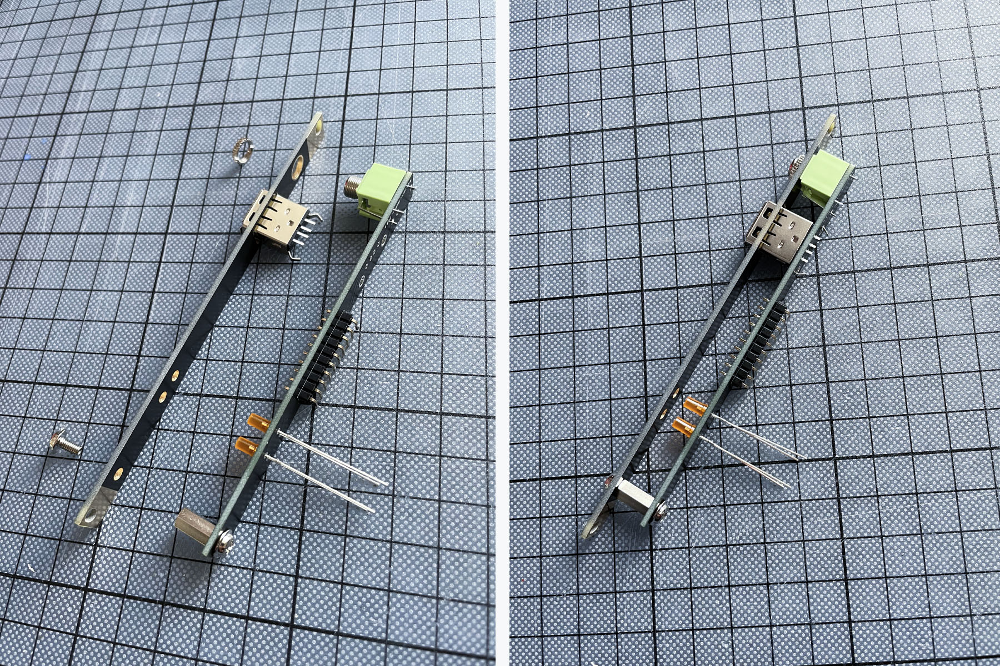

## VI
- Solder Thonkiconn and USB jack to the PCB. Make sure to use enough solder to secure the USB jack in place. 
- Carefully place the LEDs into position, so they look nice on the panel. You can position them flush with the panel or let them stick out – your choice :) If you double-checked the LEDs are in position, solder them.

## VII
- Place PCB a into the angled header of PCB b. Make sure everything is aligned nicely and PCB a is perpendicular to PCB b. It should work by just placing both PCBs flat on the table.
- Solder.
- Finally, trim all the legs on PCB a as short as possible. I prefer to trim down *all* legs (including power header, I2C header, 1x10 angled pin header) – making sure, that the width of the module is as less as possible.

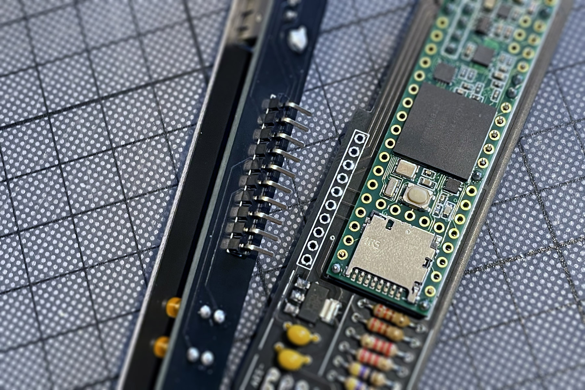
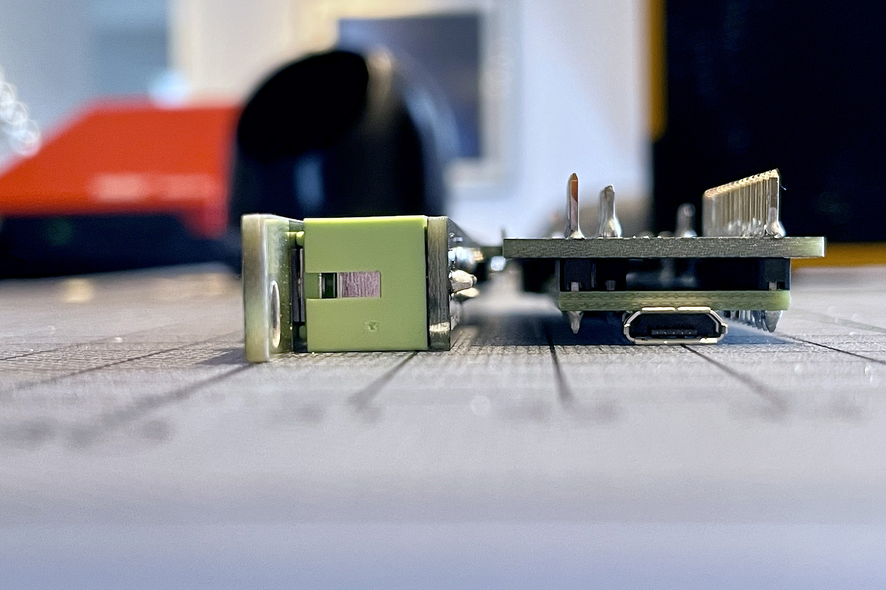
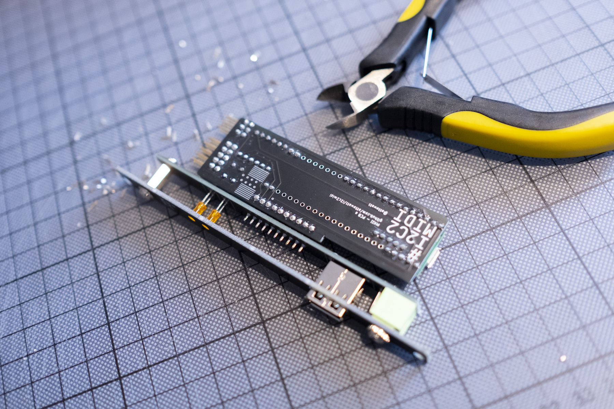

Ok, done with soldering!

## VIII
[Flash the firmware to the Teensy](https://github.com/attowatt/i2c2midi#firmware-update).

All done – Have fun!

## Disclaimer
After building the module, please test it very carefully in a separate case. This is a DIY module. I am not responsible for any damage to your gear.

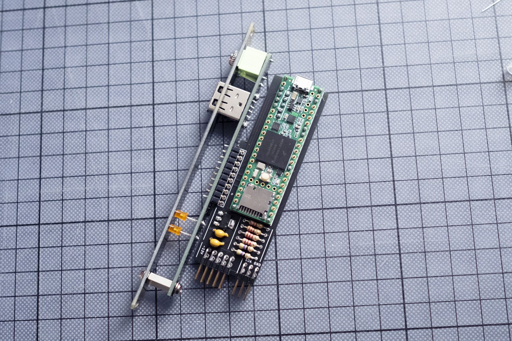

