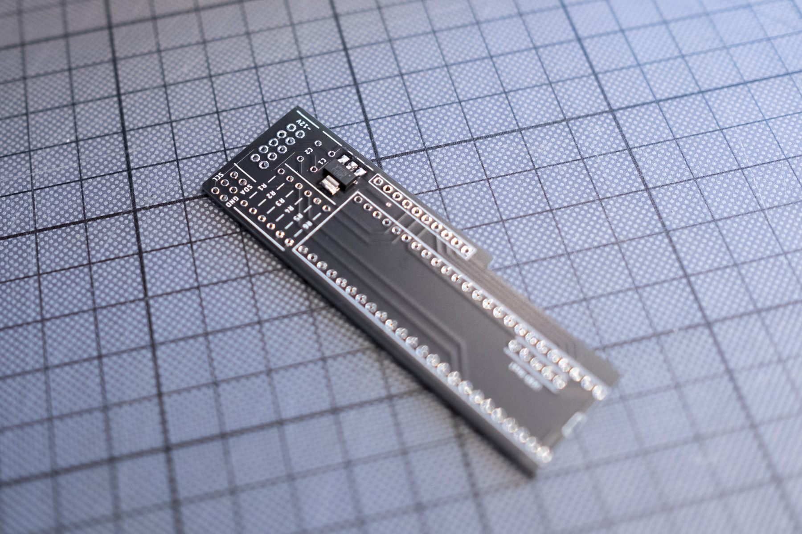
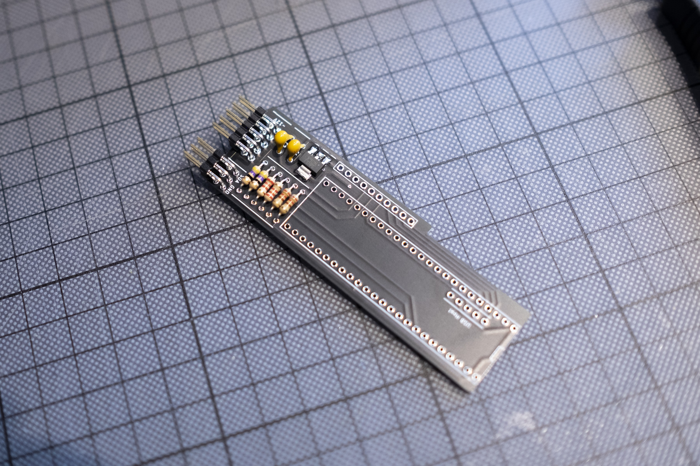
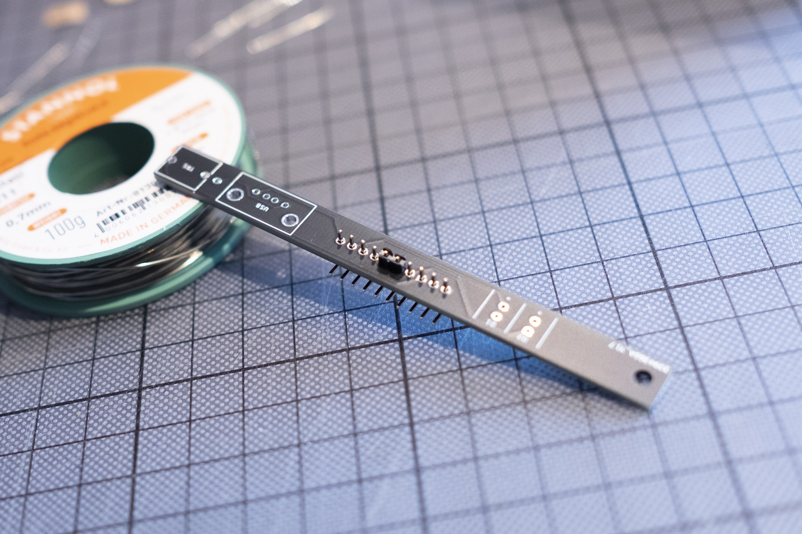

# Build Guide

## I 
Get the parts. Here's the [BOM](https://github.com/attowatt/i2c2midi#BOM).

Let's start with PCB a.

## II
- Solder the following parts to PCB a, in this order:
  - Voltage regulator (IC1)
  - Resistors (R1, R2, R3, R4, R5)
  - 2x5 angled pin header (Power connection) & 2x3 angled pin header (I2C connection)
  - Capacitors (C1, C2)
- Cut the legs of the parts as short as possible.

## III
- If your Teensy 3.6 comes without pins: Place the two 1x24 pin headers on the PCB, with the shorter legs facing up. Same with the 1x5 pin header for USB Host. Then place the Teensy on top. 
- If your Teensy 3.6 comes with pins: Place the 1x5 pin header for USB Host on the PCB, with the shorter legs facing up. Then place the Teensy on top.
- I prefer to secure the Teensy with a rubber band to the PCB, then solder the pins in each corner of the Teensy first.
- Afterwards, I solder the remaining pins, on PCB and Teensy respectively. 

PCB a done. Let's continue with PCB b.

## IV

- Solder the 1x10 angled pin header to PCB b. 
- Make sure it sits straight on the PCB. I prefer to secure the header in place with an excess spacer (1x1 or 1x2 with metal pins removed), then solder the two outer pins. I then remove the extra spacer and solder the remaining pins.

## V

- Mount the spacer to PCB b with one of the two M3 screws.
- Place the Thonkiconn stereo jack and LEDs into their positions, but don't solder them yet.
- Grab the Panel and place the USB jack through the panel.
- Place the panel on top of the stereo jack and spacer, and place the USB jack into the PCB. Secure the panel to the jack with the nut and to the spacer with the second M3 screw.

## VI
- Carefully place the LEDs into position, so they look nice on the panel. You can position them flush with the panel or let them stick out – your choice :) 
- If you double-checked the LEDs are in position, solder them.
- Then solder Thonkiconn and USB jack to the PCB. Make sure to use enough solder to secure the USB jack in place. 

# VII
- Place PCB a into the angled header of PCB b.
- Make sure everything is aligned nicely and PCB a is perpendicular to PCB b. It should work by just placing both PCBs flat on the table.
- Finally, trim all the legs on PCB a as short as possible.

Congrats, you're done with soldering.

## VIII
Flash the firmware to the Teensy.
Caution: Don't connect the module to Euro power and USB at the same time! 

**Via Teensyduino**
- Download the firmware and open it with [Teensyduino](https://www.pjrc.com/teensy/td_download.html).
- Connect the Teensy to your computer with a USB cable.
- Under `Tools`, set `Board` to `Teensy 3.6`, `USB Type` to `Serial`, and select the `Port` that shows the Teensy.
- Upload the firmware to your Teensy via `Sketch` → `Upload`. 
- If the upload was successfull, i2c2midi lights up with both LEDs turning on and off four times.

**Via Teensy Loader** (not tested)
- Download and open the [Teensy Loader App](https://www.pjrc.com/teensy/loader.html).
- Connect the Teensy to your computer with a USB cable.
- Select `File` → `Open HEX File` and load the HEX file of the firmware.
- Select `Program`.
- If the upload was successfull, i2c2midi lights up with both LEDs turning on and off four times.

## Disclaimer:
After building the module, please test it very carefully in a separate case. This is a DIY module. I am not responsible for any damage to your gear.

